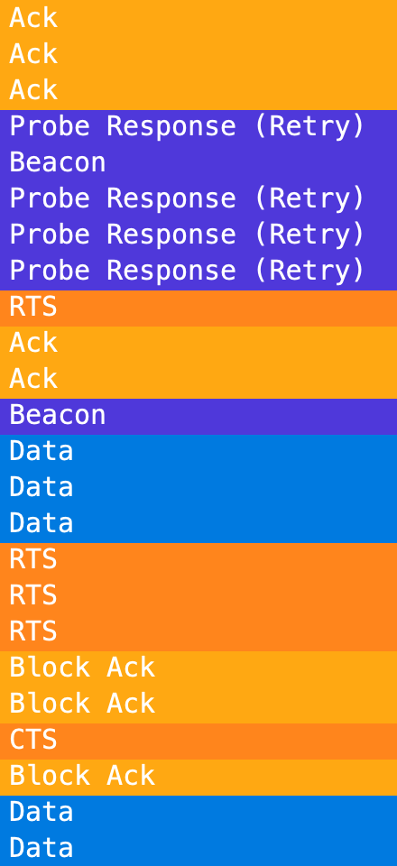
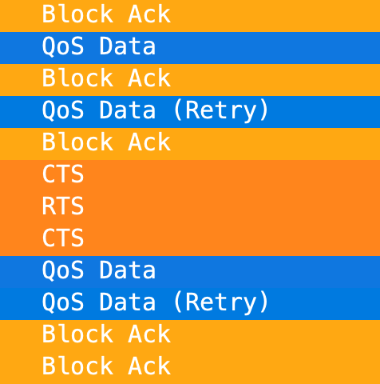

# Introduction

This Wireshark profile is designed to make Wi-Fi packet analysis is designed to focus on simplicity and readability. It is a fork of the MetaGeek Wireshark Configuration Profile.

It is based on the original frame colors from MetaGeek Eye P.A., with significant updates being added with the release of MetaGeek Tonic (now MetaGeek Chanalyzer 6).

## Installation Instructions

On macOS:

1. Download the .zip file the [Releases page](https://github.com/PotatoFi/PotatoFrames/releases).
2. Unzip the file, which will produce a **PotatoFrames** folder.
3. Open Wireshark.
4. Press `Command` + `Shift` + `A`.
5. Click the directory path in the lower right to open the **Profiles** folder.
6. Drag the **PotatoFrames** folder into the **Profiles** folder.
7. Activate the profile in the lower right corner of Wireshark.

## Colors for Frame Types
Management frames are colored purple, control frames are orange, and data frames are blue, making frame exchanges super mega easy to track.

### Bad Frame Coloring
Malformed frames and frames that fail checksums are colored red.

### Frame Sub-Type Column
See frame Sub-Types in a clear and readible column.

### Marked Retries
The frame type column marks retries without changing the color.

### Hide Frame Types
"Hide Bad", "Hide Data", "Hide Management", and "Hide Control" shortcut buttons mean that there are 4 less regular expressions for you to remember and type.

### AP/Client Conversation Shortcut
Apply the AP/Client Conversation filter, and copy/paste in your AP and client MAC addresses to quickly filter down to a specific conversation.

Replace aa:aa:aa:aa:aa:aa with AP radio MAC address
Replace cc:cc:cc:cc:cc:cc with client MAC address
